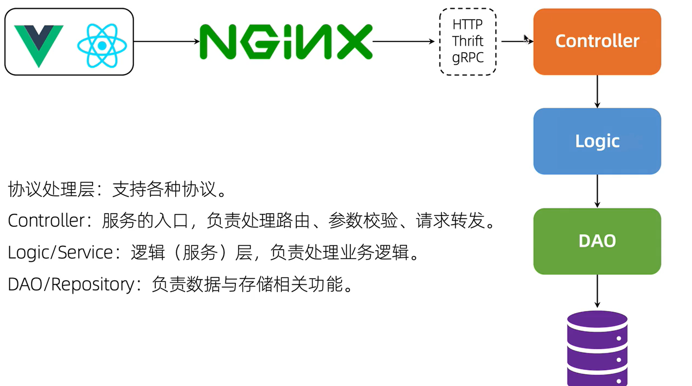

# 3
- 为什么不使用数据库自增id作为用户id

1. **隐私与安全**：自增ID按顺序分配，这使得攻击者可以轻易推测出系统的用户数量和新用户的ID。使用更加随机或难以预测的用户ID方案（如UUID）可以增加额外的安全层，减少被猜测攻击的风险。

2. **分布式系统兼容性**：在分布式系统中，多个数据库实例同时运行，为保证ID的唯一性而不发生冲突，自增ID可能不是最佳选择。UUID或其他全局唯一ID生成策略更适合这种情况。

3. **合并与迁移问题**：如果你需要合并两个不同的数据库或者从一个旧系统迁移到新系统，使用自增ID可能导致冲突。例如，两个系统中的用户可能拥有相同的自增ID值，这会导致数据合并时的问题。

4. **扩展性和灵活性**：一些业务需求可能要求ID包含更多的信息（比如时间戳、类型标识等），而不仅仅是递增的数字。使用自定义ID生成策略可以满足这种需求。

5. **性能考虑**：在高并发环境下，对自增ID的频繁操作可能会导致锁竞争，影响性能。采用分布式的ID生成算法可以在一定程度上缓解这个问题。

基于上述原因，在设计系统时，开发者可能会选择其他方法来生成用户ID，如UUID、雪花算法（Snowflake）等，这些方法在提供唯一性的同时，也增强了安全性、适应了分布式架构的要求，并且避免了合并和迁移时的潜在问题。不过，具体选择哪种方式还需根据实际应用场景的需求和约束条件进行权衡。

- 大型的分布式ID生成器

# 4 用户注册

代码分层 
看代码从入口开始看   

- **Router（路由器）**：负责将客户端请求根据URL和HTTP方法匹配到相应的处理器，起到请求分发的作用。
- **Controller（控制器）**：接收来自路由器的请求，调用业务逻辑处理请求，并准备响应内容，充当用户输入与业务逻辑之间的桥梁。
1. 获取参数和参数检验
2. 业务处理 -> logic
3. 返回响应         
- **Logic（业务逻辑）**：包含具体的业务规则和操作，如数据处理、计算或与数据库交互等，是应用程序的核心功能实现部分。

- ShouldBindJSON作用有限
字段类型对不对
是否JSON格式